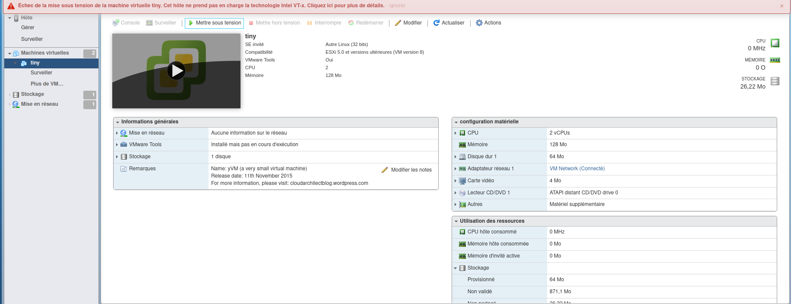
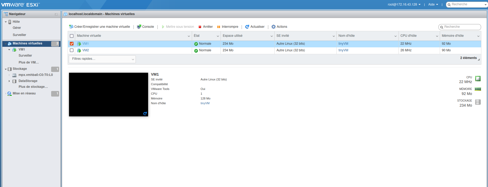
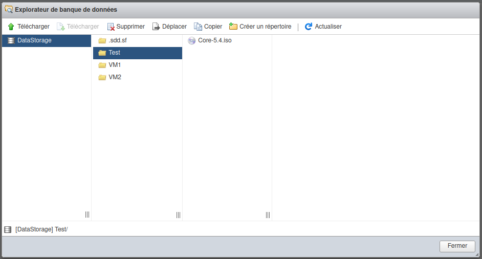

# ESXIproject

## Description
Ce projet utilise PyVmomi pour automatiser la création et le clonage de machines virtuelles sur un environnement ESXi 7.0. Il permet de déployer des machines virtuelles à partir d'une image OVA et de créer des VM à partir de zéro en utilisant des configurations définies dans un fichier JSON.

## L'objectif de ce projet est de déployer des VMs avec PyVmomi

## Prérequis
- Python 3
- ESXi 6.7 ou 7.0
- Bibliothèques Python : pyvmomi, python-dotenv
- pip install -r requirements.txt

## Partie 1 du TP

### Question 1
La virtualisation est le fait de créer plusieurs environnements virtuels à partir d'un seul système physique.

### Question 2
Installation de VirtualBox sur Linux.

### Question 3
Étant donné que la version 8.0 d'ESXi était instable, nous avons installé les versions "6.7.0" et "7.0".

### Question 4
Exécution du VM ESXi et la création des 2 VM tinyVM sur VirtualBox ont rencontré un énorme problème comme le montre la figure ci-dessous.

## L'Interface VirtualBox
Cette image représente l'interface de VMware 

Au vu de ce problème, nous nous sommes tournés vers VMware. La figure ci-dessous présente les résultats obtenus.

## L'Interface VMware
Cette image représente l'interface de VMware 

Création du répertoire test dans [DataStore1] et déploiement du fichier ISO Core-5.4.iso [datastore1] test/Core-5.4.iso http://menaud.fr/Cours/Cloud/TP/PS1/ISOLinux/Core-5.4.iso comme le montre la figure ci-dessous. 

## Commande de test de connexion
`python3 testConnexion.py` : Cette commande permet de vérifier le code contenu dans le fichier testConnexion.py

## Partie 2

### Question 7
Création du fichier de configuration JSON nommé `config.json`.

### Question 8
Déploiement et clonage de la machine virtuelle créée. Pour l'exécution, tapez la commande `python3 deploy_clones.py`.

### Question 9.1
Créer une VM from scratch. Pour l'exécution, tapez en ligne de commande `python3 create_vm.py`.

### Remarques finales
Je n'ai pas fait les questions 9.2 et 9.3 en raison du temps imparti et des évaluations que nous avons ces jours-ci.

## Difficultés rencontrées
- L'installation de ESXi n'a pas du tout été facile.
- Les difficultés de réseau.
- Le délai court.

En conclusion, ce projet a été un véritable régal pour moi. J'ai appris beaucoup de choses nouvelles, merci pour cette expérience.
